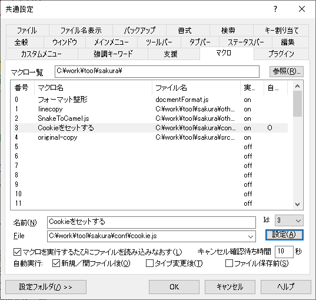
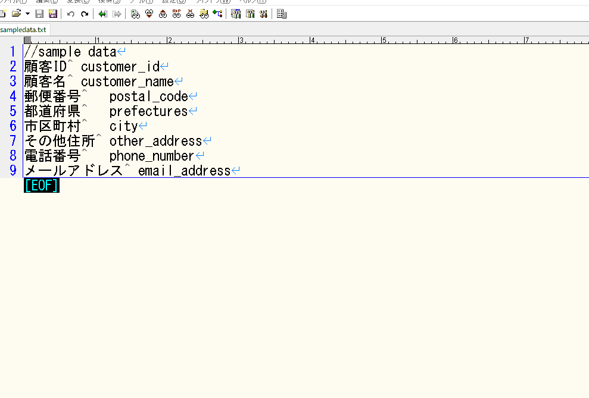

# サクラエディタマクロ(JScript)で共通モジュールを使用する方法

## 仕様について

* サクラエディタマクロで、重複したソースがあった際コピペで済ませずに共通モジュールに定義して、ファイルを呼び出す流れとする。
* 呼び出し元でなるべく関数型形式で書けるようにしている。

## 設定方法

* 資材をローカルにcloneする。

* [ホームディレクトリ配/conf/cookie.js]のマクロ登録を行う

  

* 図のように「マクロを実行するたびにファイルを読み込みしなおす」にチェックを入れて設定する
* 終わったら、新規ファイルを作成(Ctrl + N)する。(cookieマクロの読み込み用)
* 「ホームディレクトリ/src/original-copy.js」のマクロを動かしてみて動作検証をする。
  * エラーになった場合は、設定の見直しを行う必要がある。（たとえば新規ファイルを開くたびにエラーとなる場合はcookie.js、それ以外は呼び出し元のjsを疑う。）
  * TraceOutで出力したウィンドウは特殊なウィンドウの為、Cookieの読み込みが受け付けないので別ファイルを開くか新規ファイルを開いて実行してください。

## このマクロでできること

* エクセルで数式を作って表敬式のデータをテキスト整形する処理をJScript(JavaScript)で行うことができます。

  　* 例えば、スネークケースの文字列をキャメルケースやパスカルケースに置き換えたり特定のデータ形式に変換することができます。

* エクセルの手間な部分（数式が壊れやすい、再メンテが手間、マクロ組むほどじゃないけど・・・）を軽減させる目的があります。

* このマクロはなるべく共通化を行うことで、コピペで済むように構成されています。

## 基本的な流れ


### cookie.jsについて

* サクラエディタ機能のCookieを利用して外部ファイルを呼び出すモジュールを保存します。
* 外部モジュールのパスについては、内部で相対パスからフルパスを取得して読み出すようにしています。（初期処理でマクロホームディレクトリの登録処理がある）
* ここに登録された情報は、module.load("Cookie名")によって呼び出すことができます。（と言ってもグローバル変数を利用したインポートなので共通モジュールの作成も工夫が必要です。）

### original.jsについて

* 現在開いているエディタの情報をもとに1行ずつテキストを読み込んでループ処理を行う処理が実装されています。
* Sakura().lines(function)によって、行単位の値を変数とみなして様々な加工ができます。
* Sakura().lineAll(function)では、ループし終わった配列情報を取得できます。
* メソッドチェーン化されていることによって、コピペしたとしても変数の重複が起きづらくなっています。(varのスコープがfunction内部で完結するため)

### util.jsについて

* サクラエディタ機能を使わない処理をまとめたもの
* 割とUnderscore.jsがあれば解消するものばかり入っています。(キャメルケースの変換や共通系の関数)

### extLibについて

* 外部ライブラリをまとめています。
* underscore.jsや_.str.jsは、若干加工しています。（varの変数からグローバル変数に変えただけ）
* JScriptではJSONの扱いが手間なのでjson2.jsを入れることでJSON操作が可能となります。


## 呼出方法について

```javascript
eval(GetCookie("document","module"))
module.load("original");
module.load("util");
module.load("_");
```

## 呼び出し側共通記載処理

* cookie.jsで定義されているmodule.jsの値を即時実行して呼び出しています。

* 2行目以降は、module.jsに定義されているmodule.load関数を使って、cookie.jsに定義されているクッキー情報よりパスを取得し

  即時実行でスクリプト内に関数を適応しています。

* 以降で、各呼出スクリプトで定義されているglobal変数にアクセスできるようになります。

* 不要な関数であればmodule.loadの削除ができます。


## サンプルソース

```javascript
eval(Editor.GetCookie("document","module"))
module.load("original");
module.load("JSON");

// sample code
Sakura()
//配列取得
.lineAll(function(lines,obj){ // obj => {line:strLine,no:i+1,origin:origin}
    puts(JSON.stringify(lines,null,3));
    puts("---------------------------");
    puts(JSON.stringify(obj));
})
```

### 実行結果

```json
[
   "eval(Editor.GetCookie(\"document\",\"module\"))",
   "module.load(\"original\");",
   "module.load(\"JSON\");",
   "",
   "// sample code",
   "Sakura()",
   "//配列取得",
   ".lineAll(function(lines,obj){ // obj => {line:strLine,no:i+1,origin:origin}",
   "    puts(JSON.stringify(lines,null,3));",
   "    puts(\"---------------------------\");",
   "    puts(JSON.stringify(obj));",
   "})"
]
---------------------------
[{"line":"eval(Editor.GetCookie(\"document\",\"module\"))","no":2,"origin":"eval(Editor.GetCookie(\"document\",\"module\"))\r\n"},{"line":"module.load(\"original\");","no":3,"origin":"module.load(\"original\");\r\n"},{"line":"module.load(\"JSON\");","no":4,"origin":"module.load(\"JSON\");\r\n"},{"line":"","no":5,"origin":"\r\n"},{"line":"// sample code","no":6,"origin":"// sample code\r\n"},{"line":"Sakura()","no":7,"origin":"Sakura()\r\n"},{"line":"//配列取得","no":8,"origin":"//配列取得\r\n"},{"line":".lineAll(function(lines,obj){ // obj => {line:strLine,no:i+1,origin:origin}","no":9,"origin":".lineAll(function(lines,obj){ // obj => {line:strLine,no:i+1,origin:origin}\r\n"},{"line":"    puts(JSON.stringify(lines,null,3));","no":10,"origin":"    puts(JSON.stringify(lines,null,3));\r\n"},{"line":"    puts(\"---------------------------\");","no":11,"origin":"    puts(\"---------------------------\");\r\n"},{"line":"    puts(JSON.stringify(obj));","no":12,"origin":"    puts(JSON.stringify(obj));\r\n"},{"line":"})","no":13,"origin":"})\r\n"}]
```


## 操作イメージについて

#### sample001.js
```javascript
eval(GetCookie("document","module"))
module.load("original");
module.load("util");
module.load("_");


var tplMember = _.template(util.template(function(){/*
<%= comment %> 
private String <%= camel %>;
*/}));

// テーブルのカラム情報から変数名を生成。
Sakura()
.filter(function(line,no,origin){
    //余計なカラムを除外
    return line.split("\t").length == 2;
})
.map(function(line,no,origin){
    var list = line.split("\t");
    //member変数生成呼出
    var member = util.convertMember(list[1]);
    member.comment = "/** " + list[0] + "*/";
    return member;
})
.lineAll(function(lines){
    _.each(lines,function(member){
        puts(tplMember(member));
    });
    
});
```

#### sample001.jsを実行したケース



* 若干処理が重そうなのは、puts関数を複数回呼び出しているためです。本来は1回の呼出にしたほうが処理の高速化に繋がります。

  * 駄目な例：`result.forEach(function(item){puts(item)})`

  * 良い例：`puts(result.join("\n"))`


